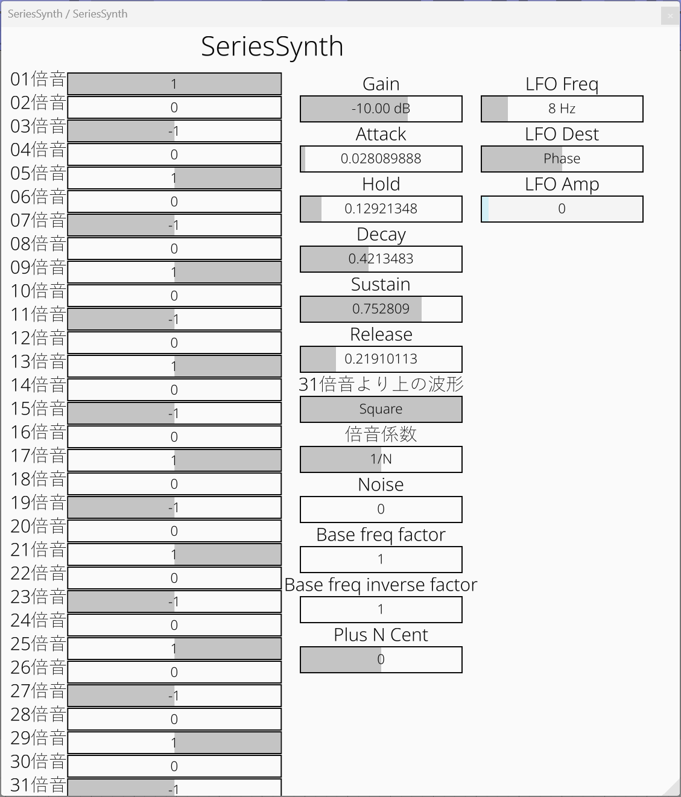

# Seriessynth

倍音で指定するタイプのオシレータを備えたシンセサイザ。
UIを見れば分かる。



## 使用技術・ライブラリ

nih-plug を使って作られている。

### CI/CD の構成

GitHub Actions でビルドして、成果物(VST3, Clap)を

GitHub Releases に上げる形。

## ビルド

After installing [Rust](https://rustup.rs/), you can compile Seriessynth as follows:

```shell
cargo xtask bundle seriessynth --release
```

↑上のようにすると、 `プロジェクトルート/target/bundled` 以下に成果物が出る。